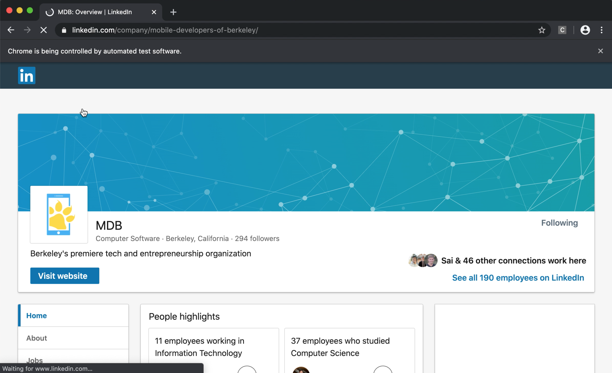
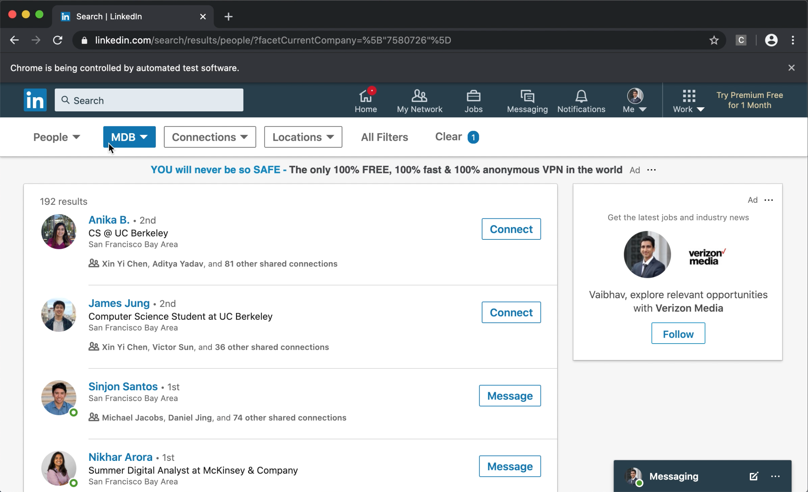
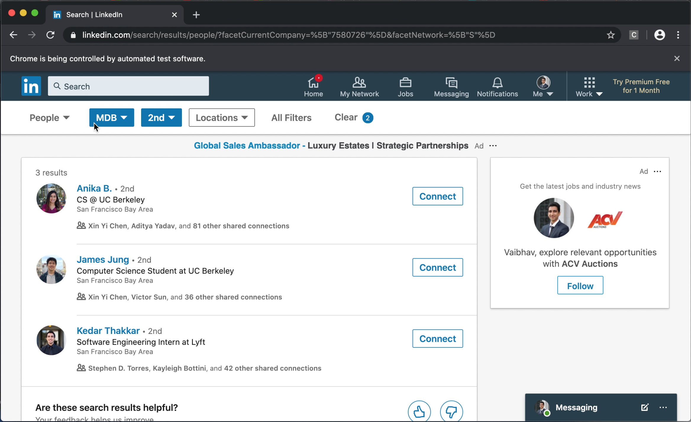

# Connect-with-Organizations-LinkedIn

## Description
This is a simple python script utilizing Selenium to automate connecting to people from a certain organization. For example, if you recently joined a student organization and want to connect with all the people in the organization, this simple script will automate the job for you. Likewise, if you joined a certain company and want to connect with all the employees, this script will do the job for you.

## Warning
LinkedIn does not allow the use of scraping/bots, thus this script would theoretically utilize random delays. Do not abuse the script.

## Usage

1. Clone/Download/Fork this repo. 
2. Install the dependancies (pip install Selenium)
3. Edit `connect.py` and enter LinkedIn email/password and the organization you wish to connect
(optional) You can comment out the connect to second connections only (connections of people you have already connected)
(optional) Edit the MESSAGE that you would like to send. An empty string will send no message.
4. Run `python3 connect.py`

## Screenshots
|         |         |            |            |  
| :-------------: | :-------------: | :-------------: | :-------------: |
| Goes to Organization Page | Views Employees | Filters for 2nd Connections | Sends connections a customized message |

